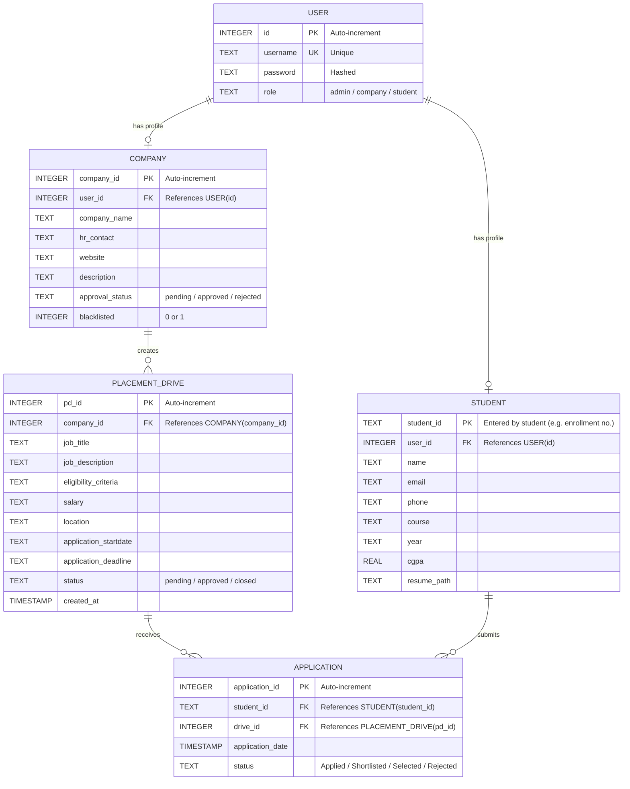

# Placement Portal Application

## Project Details

### Problem Statement

Institutes need efficient systems to manage campus recruitment activities involving companies, students, and placement drives. Currently, many institutes rely on spreadsheets, emails, or manual processes, which makes it difficult to manage company approvals, track student applications, avoid duplicate registrations, and maintain placement records.

### Approach

This project builds a **Placement Portal** web application where three types of users — **Admin (Institute)**, **Company**, and **Student** — can interact with the system based on their roles.

**How the problem is solved:**

1. **Admin** manages the entire portal — approves/rejects company registrations and placement drives, manages students and companies, and views all applications.
2. **Companies** register on the portal (pending admin approval), create placement drives, and manage student applications (shortlist, select, reject).
3. **Students** register with their unique Student ID, browse approved placement drives, apply for them, and track their application status.

Key design decisions:
- **Single `app.py`** with all routes organized by role (Admin, Company, Student) for simplicity.
- **Raw SQLite3** queries (no ORM) to keep the code straightforward and easy to understand.
- **Server-side rendering** using Jinja2 templates — no JavaScript is used for core functionality.
- **Admin is pre-seeded** in the database (`admin` / `admin123`) and cannot be registered through the portal.
- **Duplicate application prevention** is enforced at the database level using a UNIQUE constraint on `(student_id, drive_id)`.
- **Blacklisted companies** are blocked from creating new drives at the server level.

---

## Frameworks and Libraries Used

| Library | Version | Purpose |
|---------|---------|---------|
| **Flask** | 3.x | Web framework for backend routing and request handling |
| **Jinja2** | 3.x | Templating engine for rendering HTML pages (bundled with Flask) |
| **Flask-Login** | 0.6.x | User session management and authentication |
| **Werkzeug** | 3.x | Password hashing (`generate_password_hash`, `check_password_hash`) and secure file uploads |
| **SQLite3** | (built-in) | Lightweight database — no external DB server needed |
| **Bootstrap 5** | 5.3 (CDN) | Frontend CSS framework for responsive, clean UI |
| **Bootstrap Icons** | 1.11 (CDN) | Icon set used in navigation and buttons |

---

## ER Diagram



### Table Relationships

| Relationship | Type | Description |
|---|---|---|
| USER → COMPANY | One-to-One | Each company user has one company profile |
| USER → STUDENT | One-to-One | Each student user has one student profile |
| COMPANY → PLACEMENT_DRIVE | One-to-Many | A company can create multiple drives |
| PLACEMENT_DRIVE → APPLICATION | One-to-Many | A drive can receive multiple applications |
| STUDENT → APPLICATION | One-to-Many | A student can apply to multiple drives |
| (student_id, drive_id) | UNIQUE | Prevents duplicate applications |

---

## API Resource Endpoints

This application uses **server-side rendered pages** (not a REST API). All routes return HTML pages rendered via Jinja2 templates.

### Authentication Routes

| Method | Endpoint | Description |
|--------|----------|-------------|
| GET/POST | `/login` | User login page |
| GET/POST | `/register` | Registration for Company/Student |
| GET | `/logout` | Logout current user |

### Admin Routes

| Method | Endpoint | Description |
|--------|----------|-------------|
| GET | `/admin/dashboard` | Admin dashboard with stats and pending approvals |
| GET | `/admin/companies` | View/search all companies |
| GET | `/admin/students` | View/search all students |
| GET | `/admin/drives` | View all placement drives |
| GET | `/admin/applications` | View all applications |
| GET | `/admin/approve_company/<company_id>` | Approve a company |
| GET | `/admin/reject_company/<company_id>` | Reject a company |
| GET | `/admin/blacklist_company/<company_id>` | Blacklist a company |
| GET | `/admin/unblacklist_company/<company_id>` | Remove company from blacklist |
| GET/POST | `/admin/edit_company/<company_id>` | Edit company details |
| GET | `/admin/delete_company/<company_id>` | Delete a company |
| GET/POST | `/admin/edit_student/<student_id>` | Edit student details |
| GET | `/admin/delete_student/<student_id>` | Delete a student |
| GET | `/admin/approve_drive/<drive_id>` | Approve a placement drive |
| GET | `/admin/reject_drive/<drive_id>` | Reject a placement drive |

### Company Routes

| Method | Endpoint | Description |
|--------|----------|-------------|
| GET | `/company/dashboard` | Company dashboard with drives and applicant counts |
| GET/POST | `/company/profile` | Update company profile |
| GET/POST | `/company/create_drive` | Create a new placement drive |
| GET/POST | `/company/edit_drive/<drive_id>` | Edit an existing drive |
| GET | `/company/close_drive/<drive_id>` | Close a drive |
| GET | `/company/delete_drive/<drive_id>` | Delete a drive |
| GET | `/company/view_applications/<drive_id>` | View applications for a drive |
| GET | `/company/update_status/<app_id>/<status>` | Update application status |

### Student Routes

| Method | Endpoint | Description |
|--------|----------|-------------|
| GET | `/student/dashboard` | Student dashboard with stats and applications |
| GET/POST | `/student/profile` | Update profile and upload resume |
| GET | `/student/drives` | Browse approved placement drives |
| GET | `/student/apply/<drive_id>` | Apply for a drive |
| GET | `/student/history` | View placement history |

### File Serving

| Method | Endpoint | Description |
|--------|----------|-------------|
| GET | `/uploads/<filename>` | Serve uploaded resumes |

---

## How to Run

```bash
# Install dependencies
pip install -r requirements.txt

# Run the application
python app.py
```

Open **http://127.0.0.1:5000** in your browser.

**Default Admin Login:** `admin` / `admin123`
